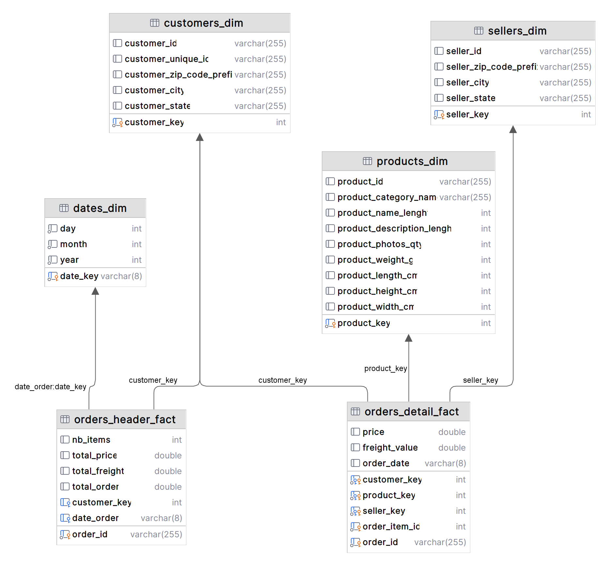

# olist-end-to-end-data-engineering-project

## Description

### Infrastructure


### Pipeline

ETL stands for Extract, Transform, Load. An ETL pipeline is a set of processes used to collect data from various
sources, transform it into a format that is suitable for analysis or storage, and then load it into a target
destination, such as a database, data warehouse, or data lake.

In this project, we focusing on generating an orders fact table from the dataset provided
by [Olist](https://www.kaggle.com/olistbr/brazilian-ecommerce) in order to analyze the sales performance of the company.

<table>
    <tr>
        <th>Component</th>
        <th>Usage</th>
    </tr>
    <tr>
        <td>Minio</td>
        <td>Minio serves as the data lake where raw data is stored before being processed.</td>
    </tr>
    <tr>
        <td>Airflow</td>
        <td>Airflow is used to orchestrate the ETL pipeline.</td>
    </tr>
    <tr>
        <td>Spark & Python</td>
        <td>PySpark is used to process the raw data and generate the orders fact table.</td>
    </tr>
    <tr>
        <td>MySQL</td>
        <td>MySQL is used as the data warehouse where the orders fact table is stored.</td>
    </tr>
</table>

### Orders Fact Table



With these tables, we can analyze the sales performance of the company. For example, we can calculate the average order
value.

```sql
select
    year, 
    month, 
    avg (total_price) as avg_total_price, 
    avg (total_freight) as avg_total_freight, 
    avg (total_order) as avg_total_order
from orders_header_fact ohf join dates_dim dd
on ohf.date_order = dd.date_key
group by dd.year, dd.month
order by dd.year, dd.month;

+------+-------+------------------+-------------------+------------------+
| year | month | avg_total_price  | avg_total_freight | avg_total_order  |
+------+-------+------------------+-------------------+------------------+
| 2016 | 9     | 89.12            | 29.13             | 118.25           |
| 2016 | 10    | 160.739          | 23.705            | 184.444          |
| 2016 | 12    | 10.9             | 8.72              | 19.62            |
| 2017 | 1     | 152.488          | 21.389            | 173.876          |
| 2017 | 2     | 142.702          | 22.491            | 165.194          |
| 2017 | 3     | 141.743          | 21.849            | 163.593          |
| 2017 | 4     | 150.534          | 21.955            | 172.489          |
| 2017 | 5     | 138.271          | 21.891            | 160.161          |
| 2017 | 6     | 134.609          | 21.736            | 156.345          |
| 2017 | 7     | 125.480          | 21.905            | 147.385          |
| 2017 | 8     | 133.699          | 21.950            | 155.650          |
| 2017 | 9     | 147.160          | 22.625            | 169.785          |
| 2017 | 10    | 145.407          | 23.006            | 168.413          |
| 2017 | 11    | 135.589          | 22.664            | 158.253          |
| 2017 | 12    | 132.275          | 21.272            | 153.547          |
| 2018 | 1     | 131.583          | 21.783            | 153.366          |
| 2018 | 2     | 126.110          | 21.322            | 147.432          |
| 2018 | 3     | 136.785          | 23.917            | 160.702          |
| 2018 | 4     | 143.733          | 23.515            | 167.248          |
| 2018 | 5     | 145.413          | 22.365            | 167.778          |
| 2018 | 6     | 140.442          | 25.577            | 166.019          |
| 2018 | 7     | 142.756          | 26.020            | 168.775          |
| 2018 | 8     | 132.468          | 23.035            | 155.503          |
| 2018 | 9     | 145.000          | 21.460            | 166.460          |
+------+-------+------------------+-------------------+------------------+
```

A lot of other questions can be answered using this dataset. But we need to build other facts tables to answer them.

### Some examples of questions that can be answered using this dataset

#### <ins>Customer Insights</ins>

1. **Who are our most valuable customers?**

2. **What is the geographic distribution of our customers?**

3. **What factors influence customer satisfaction?**

#### <ins>Sales and Revenue Analysis</ins>

4. **What are our best-selling products?**

5. **How does seasonality affect our sales?**

6. **What is the average order value (AOV)?**

#### <ins>Operational Efficiency</ins>

7. **How efficient are our delivery processes?**

8. **What is the impact of shipping delays on customer satisfaction?**

9. **What are the common reasons for order cancellations or returns?**

#### <ins>Product and Inventory Management</ins>

10. **What products have the highest return rates?**

11. **How should we manage inventory for different products?**

#### <ins>Marketing and Promotions</ins>

12. **Which marketing channels are most effective?**

13. **What types of promotions increase sales?**

#### <ins>Seller Performance</ins>

14. **Who are our top-performing sellers?**

15. **What factors contribute to seller success on the platform?**

#### <ins>Financial Metrics</ins>

16. **What is our overall revenue and profit margin?**

17. **How does payment method affect sales?**

By exploring these questions, you can gain valuable insights into customer behavior, operational efficiency, product
performance, and overall business health. This can help in making data-driven decisions to improve various aspects of
the e-commerce operation.

## Setup

### 1) Setup docker

```bash
docker-compose up
```

### 2) Setup Spark and MySQL connection in [airflow](http://localhost:8080/home)

follow
this [guide](https://airflow.apache.org/docs/apache-airflow/stable/howto/connection.html#creating-a-connection-with-the-ui)

<table>
  <tr>
    <th>Airflow login</th>
    <td>admin</td>
  </tr>
  <tr>
    <th>Airflow password</th>
    <td>admin</td>
  </tr>
</table>

<table>
  <tr>
    <th>Connection Id</th>
    <td>spark-conn</td>
  </tr>
  <tr>
    <th>Connection Type</th>
    <td>spark</td>
  </tr>
  <tr>
    <th>Host</th>
    <td>spark://spark</td>
  </tr>
  <tr>
    <th>Port</th>
    <td>7077</td>
  </tr>
</table>

<table>
    <tr>
        <th>Connection Id</th>
        <td>mysql-conn</td>
    </tr>
    <tr>
        <th>Connection Type</th>
        <td>mysql</td>
    </tr>
    <tr>
        <th>MySQL login</th>
        <td>admin</td>
    </tr>
    <tr>
        <th>MySQL password</th>
        <td>admin</td>
    </tr>
    <tr>
        <th>Host</th>
        <td>database</td>
    </tr>
    <tr>
        <th>Port</th>
        <td>3306</td>
    </tr>
</table>

### 3) Upload [dataset](https://www.kaggle.com/datasets/olistbr/brazilian-ecommerce) to datalake

use [minio web interface](http://localhost:9000) to upload dataset into olist bucket
<table>
  <tr>
    <th>login</th>
    <td>admin</td>
  </tr>
  <tr>
    <th>password</th>
    <td>adminadmin</td>
  </tr>
</table>

### 4) Download jars

download the following jars and place them in the jars folder

[mysql-connector-j](https://repo.maven.apache.org/maven2/com/mysql/mysql-connector-j/8.4.0/mysql-connector-j-8.4.0.jar) >>
used to connect to data warehouse

[hadoop-aws](https://repo.maven.apache.org/maven2/org/apache/hadoop/hadoop-aws/3.3.4/hadoop-aws-3.3.4.jar) & [aws-java-sdk](https://repo.maven.apache.org/maven2/com/amazonaws/aws-java-sdk-bundle/1.12.262/aws-java-sdk-bundle-1.12.262.jar) >>
used to connect to datalake
